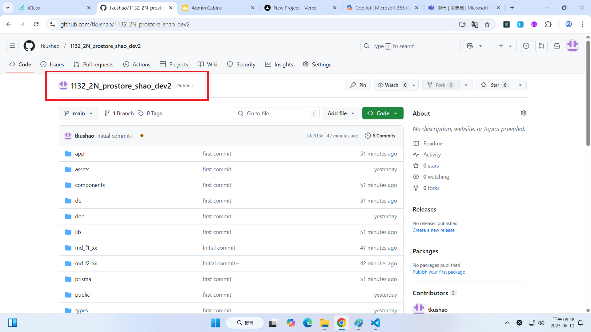

# (30%) 113-2 Web 程式設計一 期末 final2 -- 開放考試

##### 2025-04-09, at E201, from 21:10~21:50

#### Note:

1. 請不要發揮同學愛，作弊雙方除了本次考試 0 分外，平常分數另扣 20 分，情節嚴重者會送校。
2. iClass 上請繳交 md_f2_xx.pdf, md_f2_xx.zip(md 壓縮檔)
3. 請直接將答案寫在 md_f2_xx.md 上，老師出題及圖片放在 md_f2_htc.pdf 上，請依照老師所給的圖片來實作並標註
4. 跟期末考相關的檔案及目錄名稱有 xx 時，必須要改成學號後 2 碼，沒有修改時，會視違犯情況扣分。
5. 每一張圖片要有機房左側背景，圖片上要有你的學號(或後兩碼)，圖片標註要跟老師所標註的類似。違者會依情節扣分。
6. 請自評分數，將每一題的 ? 填入分數，沒有填者，不會批改，以 0 分計算。

##### Your (Name, ID): (黃崇劭, 912410049)

final1: 70% 斷網

- P1 (10%): ? 分
- P2 (10%): ? 分
- P3 (15%): ? 分
- P4 (10%): ? 分
- P5 (10%): ? 分
- P6 (5%): ? 分
- P7 (10%): ? 分

final2: 30% 開放網路

- P8 (10%): 10 分
- P9 (10%): 0 分
- P10 (10%): 0 分

##### 總分: 10 分

#### (10%) P8: 顯示你所維護 prostore_xx project，安裝在 Github 及 Vercel 相關資訊

##### => 顯示 Prostore_xx Github URL 及 圖片

[Prostore_xx Github URL]()

##### => 顯示 Prostore_xx Vercel URL，請將 cookies 全部砍掉，重新開始

[Prostore_xx Vercel URL]()

#### Your Answer

##### => 顯示 Prostore_xx Github URL 及 圖片

[Prostore_49 Github URL](https://github.com/tkushao/1132_2N_prostore_shao_dev2)

##### => 顯示 Prostore_xx Vercel URL，請將 cookies 全部砍掉，重新開始

[Prostore_xx Vercel URL]()

---

#### (10%) P9: 以 admin 角色登入，進入 Admin 選單 Users

##### => 點選 Admin 選單上的 User，並標註你所登入的那位 admin

##### => 透過 /api/auth/session 確認登入者的資訊，要跟上圖一致，本題才算通過

#### Your Answer

##### => 點選 Admin 選單上的 User，並標註你所登入的那位 admin

##### => 透過 /api/auth/session 確認登入者的資訊，要跟上圖一致，本題才算通過

---

### (10%) P10: 以 admin 角色登入，進入 Admin 選單 Products

##### => 點選 Admin 選單上的 Products，選擇某一筆資料更新

將 price 改成 49.95, stock 改成 50

##### => 回到 products listing，檢視資料有沒有被更新，有更新才算通過

#### Your Answer

##### => 點選 Admin 選單上的 Products，選擇某一筆資料更新

將 price 改成 49.95, stock 改成 50

##### => 回到 products listing，檢視資料有沒有被更新，有更新才算通過

